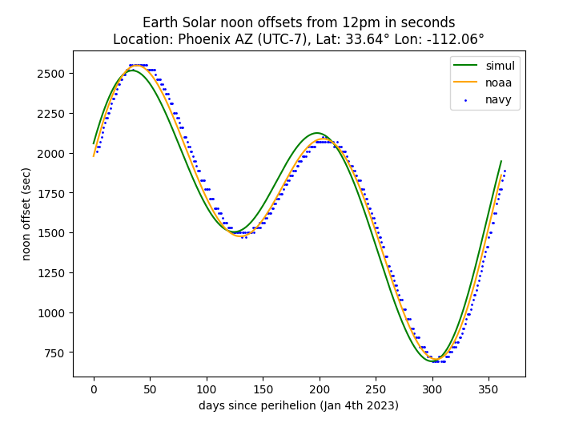

# Solar Noon Simulation

Unlike the lengths of days that change throughout the year in a regular fashion, i.e. a simple sinusoidal form with maxima and minima at summer and winter solstices respectively, the position of the solar noon has a rather complex behavior. This is due to the fact that we have two contributing factors: (1) the Earth orbial eccentricity (deviation from a perfect circle to an ellipse) and (2) the axial tilt which also causes seasons. Both factors affect the timing of solar noons, albeit with different frequencies and phases.

Individual Effects:

  
   

The goal of the project is to use a finite difference simulation technique to derive the orbital shape and subsequently calculate the noon time variation and compare to the official/observation data.

## Code Structure:
* simul/: core simultion methods
* test/: tests
* data/: observation data (U.S. Navy and NOAA)
* figures/: generated figures and manual calculations
* util/: utility functions to import published data

## Observation Data Sources:
* NOAA: https://gml.noaa.gov/grad/solcalc/table.php?lat=33.46&lon=-112.06&year=2023
* US Navy (sunrise/sunset): https://aa.usno.navy.mil/data/RS_OneYear

